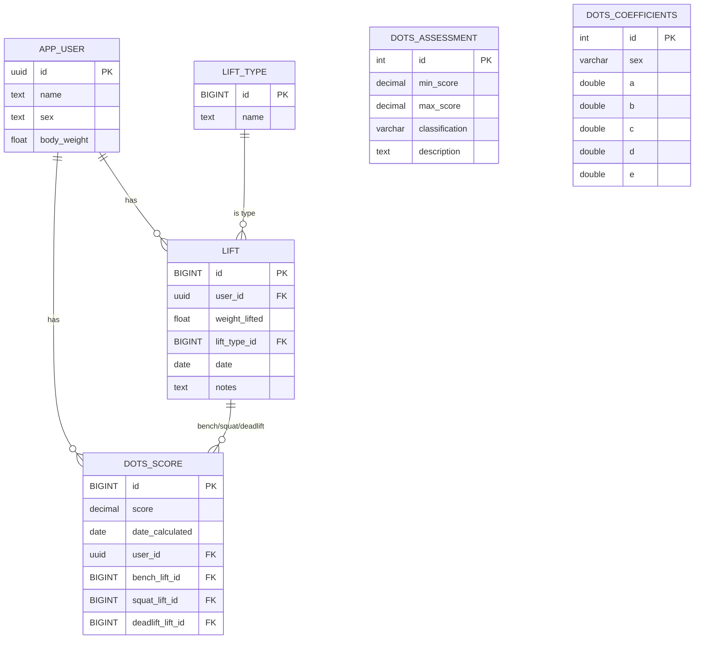

# PowerLifting Records Backend

This backend powers a Powerlifting records and calculation frontend application. Built with Node.js, Express, and PostgreSQL, it manages lift data, calculates DOTS scores for fair lifter comparison, and provides a RESTful API for all core features.

DOTS (Dynamic Objective Team Scoring) is a widely used formula in powerlifting to fairly compare lifters of different body weights. By calculating a DOTS score for each lifter, the system enables objective ranking and classification regardless of weight class.

## Features
- Manage lift types (e.g., squat, bench, deadlift)
- Record user lifts and calculate DOTS scores
- DOTS score classification and coefficient endpoints
- RESTful API endpoints for interacting with the database
- API documentation with Swagger

## Prerequisites
- Node.js (v16 or later)
- PostgreSQL (v13 or later)
---

## Data Model



---

## Set Up Instructions

1. **Clone the repository**
   ```bash
   git clone <your-repo-url>
   cd my-pbs-backend
   ```

2. **Install dependencies**
   ```bash
   npm install
   ```

3. **Configure environment variables**

   Create a `.env` file in the root directory and add your PostgreSQL credentials:
   ```
   DB_USER=your_db_user
   DB_PASSWORD=your_db_password
   DB_NAME=your_db_name
   DB_PORT=5432
   PORT=3000
   ```

4. **Set up the database**

   - Create your database in PostgreSQL if it doesn't exist:
     ```sql
     CREATE DATABASE your_db_name;
     ```
   - In the psql shell, run the migration scripts in the `sql/migrations/` folder to create the necessary tables:
    ```bash
    postgres-# \i /fullpathtoyourlocalfolder/sql/mirgations/create_lift_type_table.sql
    postgres-# \i /fullpathtoyourlocalfolder/sql/mirgations/create_app_user_table.sql
    postgres-# \i /fullpathtoyourlocalfolder/sql/mirgations/create_lift_table.sql
    postgres-# \i /fullpathtoyourlocalfolder/sql/mirgations/create_dots_score_table.sql
    postgres-# \i /fullpathtoyourlocalfolder/sql/mirgations/create_dots_coefficients_table.sql
    postgres-# \i /fullpathtoyourlocalfolder/sql/mirgations/create_dots_assessment_table.sql
    ```
   - Seeded data is automatically added.

5. **Start the server**
  
   ```bash
   npx nodemon index.js
   ```

6. **Test the API**
   - The server will run at [http://localhost:3000/](http://localhost:3000/)
   - Use Postman, curl, or your frontend to interact with the endpoints.

7. **API documentation**
   - API documentation can be found at [http://localhost:3000/api-docs/#/](http://localhost:3000/api-docs/#/)

---

## Base URL

```
http://localhost:3000/
```

---

## Endpoints

### **Lift Types**
- **GET `/lift-type`**  
  Get all available lift types.

---

### **Lifts**
- **GET `/lift/user/:userId/:liftTypeId`**  
  Get all lifts of a specific type for a user.

- **GET `/lift/:liftId`**  
  Get a specific lift by its ID.

- **POST `/lift`**  
  Add a new lift.  
  **Body:**
  ```json
  {
    "user_id": "uuid",
    "weight_lifted": number,
    "lift_type_id": "uuid",
    "date": "YYYY-MM-DD",
    "notes": "optional string"
  }
  ```

- **PUT `/lift/:liftId`**  
  Edit a lift by its ID.  
  **Body:** (same as POST)

- **DELETE `/lift/:liftId`**  
  Delete a lift by its ID.

---

### **DOTS Scores**
- **GET `/dots/user/:userId`**  
  Get all DOTS scores for a user.

- **GET `/dots/:scoreId`**  
  Get a specific DOTS score by its ID.

- **POST `/dots`**  
  Add a new DOTS score.  
  **Body:**
  ```json
  {
    "score": number,
    "user_id": "uuid",
    "bench_lift_id": "uuid",
    "squat_lift_id": "uuid",
    "deadlift_lift_id": "uuid"
  }
  ```

- **DELETE `/dots/:scoreId`**  
  Delete a DOTS score by its ID.

---

### **DOTS Classifications**
- **GET `/classification`**  
  Get all DOTS score classifications.

- **GET `/classification/score/:score`**  
  Get the classification label for a specific DOTS score.

---

### **DOTS Coefficients**
- **GET `/coefficients/:sex`**  
  Get DOTS calculation coefficients for a given sex (`male` or `female`).

---

## Validation

- POST and PUT endpoints for adding or editing lifts use server-side validation (Joi) to ensure data integrity.

---
## Notes

- All endpoints return JSON.
- Ensure your database is set up and migrations are run before starting the server.

---
