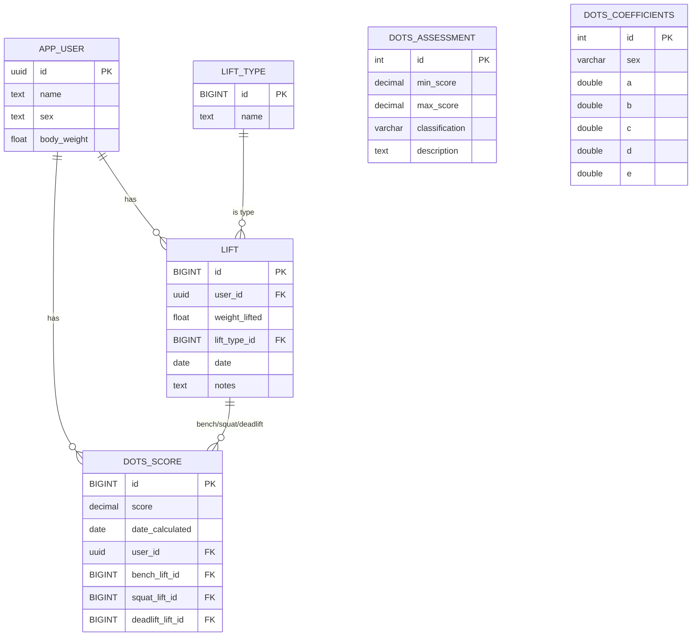

# PowerLifting Records Backend

A backend service for managing powerlifting records and calculations. Built with **Node.js**, **Express**, and **PostgreSQL** (on Docker), it manages lift data, calculates DOTS scores for fair lifter comparison, and provides a RESTful API.

> **DOTS (Dynamic Objective Team Scoring)** is a widely used formula in powerlifting to compare lifters of different body weights. By calculating a DOTS score for each lifter, the system enables objective ranking and classification regardless of weight class.

---

## Features

- Manage lift types (e.g., squat, bench, deadlift)
- Record user lifts and calculate DOTS scores
- DOTS score classification and coefficient endpoints
- RESTful API endpoints for all core features
- API documentation with Swagger

---

## Prerequisites

- Node.js (v16 or later)
- Docker

---

## Data Model



---

## Setup Instructions

1. **Clone the repository**
  ```bash
  git clone <your-repo-url>
  cd my-pbs-backend
  ```

2. **Install dependencies**
  ```bash
  npm install
  ```

3. **Configure environment variables**

  Create a `.env` file in the root directory:
  ```
  DB_HOST=db
  DB_PORT=5432
  DB_USER=your-user-name
  DB_PASSWORD=your-password
  DB_NAME=mydb
  ```

4. **Build and start the backend and database with Docker**
  ```bash
  docker compose build
  docker compose up
  ```
  Once containers are ready, you can (optionally) seed the database:
  ```bash
  docker exec -it my_backend node sql/seeds/run_seeds.js
  ```
  > `'my_backend'` is the backend container name from `docker-compose.yml`.

5. **Connect to the database**
  ```bash
  docker exec -it my_postgres psql -U <user-name> -d <db-name>
  ```
  > `'my_postgres'` is the database container name from `docker-compose.yml`.

6. **Test the API**
  - Server runs at [http://localhost:3000/](http://localhost:3000/)
  - Use Postman, curl, or your frontend to interact with endpoints.

7. **Run SQL or API tests**
  - Tests run automatically when Docker is up.
  - To run a specific test file:
    ```bash
    docker exec -it my_backend npx jest test/test-file-name.test.js
    ```

8. **API documentation**
  - Available at [http://localhost:3000/api-docs/#/](http://localhost:3000/api-docs/#/)

---

## Base URL

```
http://localhost:3000/
```

---

## Endpoints

### Lift Types

- **GET `/lift-type`**  
  Get all available lift types.

---

### Lifts

- **GET `/lift/user/:userId/:liftTypeId`**  
  Get all lifts of a specific type for a user.

- **GET `/lift/:liftId`**  
  Get a specific lift by its ID.

- **POST `/lift`**  
  Add a new lift.  
  **Body:**
  ```json
  {
  "user_id": "uuid",
  "weight_lifted": number,
  "lift_type_id": "bigint",
  "date": "YYYY-MM-DD",
  "notes": "optional string"
  }
  ```

- **PUT `/lift/:liftId`**  
  Edit a lift by its ID.  
  **Body:** (same as POST)

- **DELETE `/lift/:liftId`**  
  Delete a lift by its ID.

---

### DOTS Scores

- **GET `/dots/user/:userId`**  
  Get all DOTS scores for a user.

- **GET `/dots/:scoreId`**  
  Get a specific DOTS score by its ID.

- **POST `/dots`**  
  Add a new DOTS score.  
  **Body:**
  ```json
  {
  "score": number,
  "user_id": "uuid",
  "bench_lift_id": "uuid",
  "squat_lift_id": "uuid",
  "deadlift_lift_id": "uuid"
  }
  ```

- **DELETE `/dots/:scoreId`**  
  Delete a DOTS score by its ID.

---

### DOTS Classifications

- **GET `/classification`**  
  Get all DOTS score classifications.

- **GET `/classification/score/:score`**  
  Get the classification label for a specific DOTS score.

---

### DOTS Coefficients

- **GET `/coefficients/:sex`**  
  Get DOTS calculation coefficients for a given sex (`male` or `female`).

---

## Validation

- POST and PUT endpoints for lifts use server-side validation (Joi) to ensure data integrity.

---

## Notes

- All endpoints return JSON.
- Ensure backend and database are running on Docker before accessing the API.

